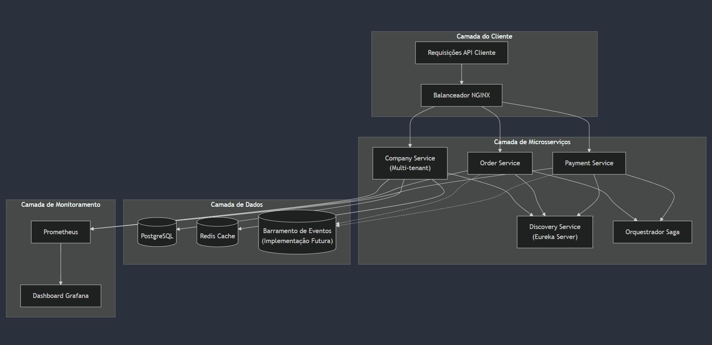
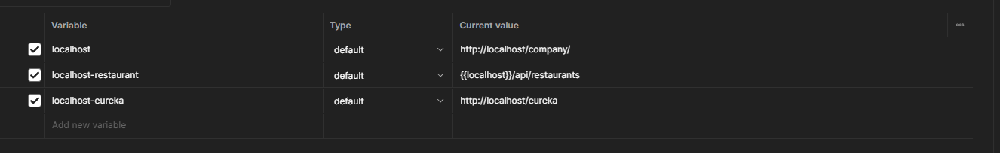

# Sistema de Microsserviços Cloud Native

Uma arquitetura de microsserviços distribuídos construída com Spring Boot e Kotlin, focada em práticas cloud-native e padrões de sistemas distribuídos.

## Arquitetura do Sistema


## Visão Geral do Projeto

Este projeto implementa uma arquitetura de microsserviços escalável usando tecnologias cloud-native modernas. O sistema é centrado no Company Service, que atua como um hub central capaz de gerenciar diferentes tipos de empresas e suas estruturas específicas. A implementação atual demonstra isso através do domínio de restaurantes, mas a arquitetura foi projetada para expandir e acomodar diversos tipos de negócios.

### Principais Características

- Hub central extensível (Company Service)
- Service discovery com Eureka
- Cache distribuído com Redis
- Gerenciamento de banco de dados com PostgreSQL
- Monitoramento e métricas com Prometheus e Grafana
- Balanceamento de carga com NGINX
- Arquitetura orientada a eventos (em construção)
- Padrão Saga para transações distribuídas

## Descrição dos Serviços

### Company Service (Hub Central)
- Serviço central do sistema
- Implementa Clean Architecture e princípios DDD
- Estrutura atual para domínio de restaurantes:
  - Gestão de marcas (brands)
  - Controle de estabelecimentos (establishments)
  - Gerenciamento de cozinhas (kitchens)
  - Controle de mesas (kitchen tables)
- Preparado para expansão para outros domínios de negócio
- Monitoramento de métricas e saúde

### Discovery Service
- Implementação do servidor Eureka
- Registro e descoberta de serviços
- Suporte a balanceamento de carga

### Saga Orchestrator Service (Em construção)
- Gerenciará transações distribuídas
- Coordenação entre Order e Payment services
- Implementa o padrão Saga para consistência de dados

### Order Service (Em construção)
- Tratamento de pedidos dos clientes
- Arquitetura orientada a eventos
- Integração com processamento de pagamentos

### Payment Service (Em construção)
- Gerencia processamento de pagamentos
- Arquitetura orientada a eventos
- Tratamento seguro de transações

## Stack Técnica

- **Backend**: Spring Boot com Kotlin
- **Ferramenta de Build**: Gradle
- **Bancos de Dados**: 
  - PostgreSQL (banco principal)
  - Redis (cache)
- **Service Discovery**: Netflix Eureka
- **Migração de Banco**: Liquibase
- **Monitoramento**: 
  - Prometheus (coleta de métricas)
  - Grafana (visualização)
- **Balanceador de Carga**: NGINX
- **Controle de Versão**: Git

## Como Começar

### Pré-requisitos
- Docker 4.37.1 ou superior
- Docker Compose (utilizar o que já foi comitado)
- Java 21+
- Kotlin 1.9.25
- PostgreSQL 17
- Redis (Uma conta criada no redis.io e banco em cache inicializado para ser mapeado pelo company-service)

### Configuração do Docker

O projeto utiliza Docker para containerizar todos os serviços e facilitar o desenvolvimento. A estrutura Docker inclui:

#### Arquivos de Configuração
- `docker-compose.yml` - Orquestração principal dos serviços
- `grafana.yml` - Configuração do Grafana
- `prometheus.yml` - Configuração do Prometheus
- `nginx.conf` - Configuração do proxy reverso


#### Serviços Containerizados
```yaml
services:
  # LOADBALANCER - NGINX
  nginx:
    image: nginx:latest
    volumes:
      - ./nginx.conf:/etc/nginx/nginx.conf
    ports:
      - "80:80"
    networks:
      - company-network
      - monitoring-network
    extra_hosts:
      - "host.docker.internal:host-gateway"

  # INFRASCTRUCTURE - MONITORING
  discovery-service:
    build:
      context: ./discovery-service
      dockerfile: Dockerfile
    env_file:
      - .env
    ports:
      - "8761:8761"
    environment:
      - EUREKA_HOSTNAME=${EUREKA_HOSTNAME}
    networks:
      - company-network
      - monitoring-network

  prometheus:
    image: prom/prometheus:latest
    container_name: prometheus
    volumes:
      - ./prometheus.yml:/etc/prometheus/prometheus.yml
    ports:
      - "9090:9090"
    networks:
      - monitoring-network
  grafana:
    image: grafana/grafana:9.5.2
    
    container_name: grafana
    ports:
      - "3000:3000"
    restart: unless-stopped
    volumes:
      - ./grafana.yml:/etc/grafana/grafana.yml
    depends_on:
      - prometheus
    networks:
      - monitoring-network  

  # INFRASCTRUCTURE - DATABASE
  company-postgres:
    image: postgres:latest
    ports:
      - "5434:5432"
    volumes:
      - postgres_data:/var/lib/postgresql/data
    networks:
      - company-network
    environment:
      - POSTGRES_DB=${COMPANY_POSTGRES_DB}
      - POSTGRES_USER=${COMPANY_POSTGRES_USER}
      - POSTGRES_PASSWORD=${COMPANY_POSTGRES_PASSWORD}


  # INFRASCTRUCTURE - MICROSERVICES
  company-service:
    container_name: company-service-1
    build:
      context: ./company-service
      dockerfile: Dockerfile
    env_file:
      - .env
    ports:
      - "8080:8080"
    environment:
      - COMPANY_SPRING_DATASOURCE_URL=${COMPANY_SPRING_DATASOURCE_URL}
      - COMPANY_POSTGRES_USER=${COMPANY_POSTGRES_USER}
      - COMPANY_POSTGRES_PASSWORD=${COMPANY_POSTGRES_PASSWORD}

      - COMPANY_REDIS_CACHE_PASSWORD=${COMPANY_REDIS_CACHE_PASSWORD}
      - COMPANY_REDIS_CACHE_PORT=${COMPANY_REDIS_CACHE_PORT}
      - COMPANY_REDIS_CACHE_URL=${COMPANY_REDIS_CACHE_URL}

      - SPRING_JPA_HIBERNATE_DDL_AUTO=none
      - SPRING_LIQUIBASE_ENABLED=true

      - EUREKA_URL_DEFAULT=${EUREKA_URL_DEFAULT}
    depends_on:
      - company-postgres
      - discovery-service
    networks:
      - company-network
    volumes:
      - .env:/app/.env


networks:
  company-network:
  monitoring-network:

volumes:
  postgres_data:
```

### Inicializando o Projeto

1. Certifique-se de que o Docker Desktop (4.37.1 ou superior) está instalado e rodando

2. Configure o arquivo `.env`:
```env
SPRING_PROFILES_ACTIVE=dev

# Database - PostgreSQL
COMPANY_POSTGRES_DB=<DATABASE>
COMPANY_POSTGRES_USER=<USER_POSTGRES>
COMPANY_POSTGRES_PASSWORD=<PASSWORD_POSTGRES>
COMPANY_SPRING_DATASOURCE_URL=jdbc:postgresql://localhost:<PORT>/<DATABASE>

# Database - Redis Cache
COMPANY_REDIS_CACHE_URL=<REDIS_URL_INSTANCE>
COMPANY_REDIS_CACHE_PORT=<REDIS_PORT_INSTANCE>
COMPANY_REDIS_CACHE_PASSWORD=<REDIS_PASSWORD_INSTANCE>
```

3. Execute os serviços:
```bash
# Build dos serviços
docker-compose build

# Iniciando todos os serviços
docker-compose up -d

# Verificando os logs
docker-compose logs -f

# Para parar todos os serviços
docker-compose down
```

4. Verificação dos serviços:
   - Eureka: http://localhost:8761 | http://127.0.0.1:8761
   - Company Service: http://localhost:8080 | http://127.0.0.1:8080
   - Prometheus: http://localhost:9090 | http://127.0.0.1:9090
   - Grafana: http://localhost:3000 | http://127.0.0.1:3000

### Comandos Docker Úteis
```bash
# Verificar status dos containers
docker-compose ps

# Reiniciar um serviço específico
docker-compose restart [service-name]

# Visualizar logs de um serviço específico
docker-compose logs -f [service-name]

# Limpar volumes e containers
docker-compose down -v

# Reconstruir um serviço específico
docker-compose up -d --build [service-name]
```

### Troubleshooting

1. Se o PostgreSQL não iniciar:
   - Verifique se as variáveis de ambiente estão configuradas corretamente
   - Tente limpar o volume: `docker volume rm postgres_data`

2. Se o Redis não conectar:
   - Verifique se a senha no .env corresponde à configuração do Redis
   - Confirme se a porta 6379 está disponível

3. Se o Discovery Service não registrar os serviços:
   - Verifique os logs do Eureka Server
   - Confirme se as configurações de rede estão corretas

## Documentação da API

Uma coleção completa do Postman está disponível no repositório para testar todos os endpoints disponíveis. Principais endpoints incluem:

### Company Service
- GET /company/api/restaurants/establishments - Lista todos os restaurantes
- GET /company/api/restaurants/establishments/{id} - Busca restaurante por ID
- POST /company/api/restaurants/establishments - Cria novo restaurante
- PUT /company/api/restaurants/establishments/{id} - Atualiza restaurante
- DELETE /company/api/restaurants/establishments/{id} - Remove restaurante

Endpoints adicionais para mesas, marcas e estabelecimentos estão disponíveis e documentados na coleção do Postman localizada na pata postman-endpoints.

## Variáveis POSTMAN


## Monitoramento e Métricas

O projeto inclui monitoramento abrangente usando Prometheus e Grafana:
- Métricas de saúde dos serviços
- Monitoramento de performance
- Utilização de recursos
- Métricas de negócio personalizadas

Após a inicialização do grafana importe o layout da JVM para contribuir ainda mais com os dados fornecidos pelo company-service: https://grafana.com/grafana/dashboards/4701-jvm-micrometer/ |  4710

## Melhorias Futuras

1. Implementação do Order Service
2. Implementação do Payment Service
3. Integração da arquitetura orientada a eventos
4. Implementação do padrão Saga para transações distribuídas
5. Monitoramento e alertas aprimorados
6. Suporte a deploy no Kubernetes
7. Expansão para novos domínios de negócio além de restaurantes

## Contato - Felipebs
- E-mail: 07felipebs07@gmail.com